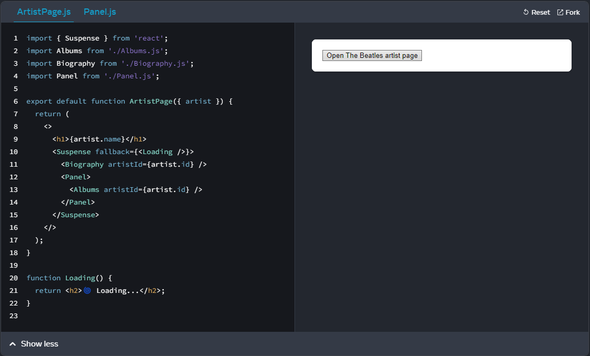
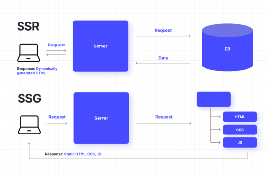
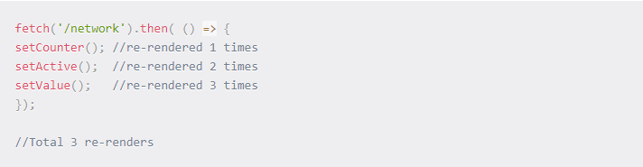

# React18 New Features
### How a new concurrency works and what is the main difference to old version of React rendering model?

- It enables React to prepare multiple versions of your UI at the same time.
- In React 18, before adding any concurrent features, updates are rendered the same as in previous versions of React — in a single, uninterrupted, synchronous transaction. With synchronous rendering, once an update starts rendering, nothing can interrupt it until the user can see the result on screen.

### What is a <code> < Suspence> </code> component and give one example where it should be used?

- React will display your loading fallback until all the code and data needed by the children has been loaded.
- In the example below, the Albums component suspends while fetching the list of albums. Until it’s ready to render, React switches the closest Suspense boundary above to show the fallback—your Loading component. Then, when the data loads, React hides the Loading fallback and renders the Albums component with data.

### What is a <code> useTransition() </code>hook and where it should be used?

- It is designed to manage complex UI transitions by allowing you to defer the rendering of certain components.
- The primary goal of useTransition is to enable React applications to stay responsive and maintain smooth animations even during heavy operations, such as data fetching, large-scale updates, or any process that might cause the UI to freeze temporarily.

### When you should use SSR and when not? 

- SSR is recommended for apps in which you have to pre-render frequently updated data from external sources. This technique is especially recommended when the data cannot be statically generated before a user request takes place, and at the same time needs to be available to search engines

### What is a <code>useId</code> hook and where it should be used?

- Generating unique IDs for accessibility attributes, Generating IDs for several related elements, Specifying a shared prefix for all generated IDs

### A few questions was presented. Did you find some other good new feature. Just name it in here and explain why feature is good one.

- ### Automatic Batching: 
  - state updates that happened outside of event handlers were not batched. For example, if you had a promise or were making a network call, the state updates would not be batched. Like this:
    
  -  React 18 introduces automatic batching which allows all state updates – even within promises, setTimeouts, and event callbacks – to be batched. This significantly reduces the work that React has to do in the background. React will wait for a micro-task to finish before re-rendering.

Automatic batching is available out of the box in React, but if you want to opt-out you can use flushSync.

